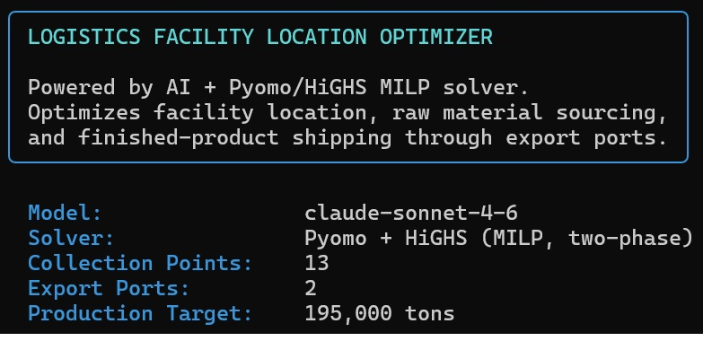
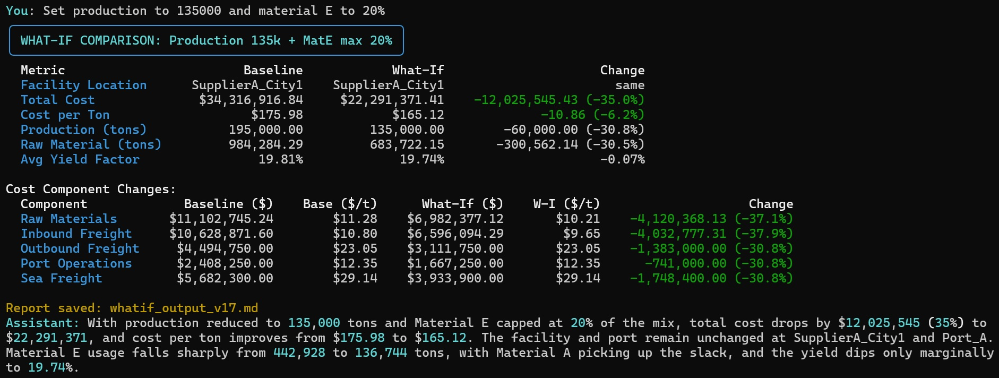

# Logistics Facility Location Agent

A CLI-based **agentic logistics optimization system** that combines Mixed-Integer Linear Programming (MILP) with a Claude-powered agent loop. Users interact via natural language — the agent autonomously decides which optimization tools to call, runs the solver, compares scenarios, and delivers plain-language business insights.

---

## What It Does

The system finds the optimal production facility location from a set of raw material collection points and minimizes total logistics costs across:

- **Facility selection** — which collection point site becomes the production facility
- **Raw material sourcing** — which sources supply which materials and in what quantity
- **Port selection** — which export port(s) to route finished product through

The optimizer uses a **two-phase MILP approach**:

1. **Phase 1:** Find the optimal facility location using Materials A–D (excluding MaterialE, simulating a strategic constraint)
2. **Phase 2:** Re-optimize the full network with MaterialE included, facility fixed from Phase 1

After establishing a baseline, users can ask natural language questions. The agent autonomously calls the solver tools to run what-if scenarios, compare results, and summarize findings.





---

## Architecture

This prototype uses a **Claude API agentic loop** as its orchestration layer. The agent receives a data-aware system prompt and has access to two tools:

| Tool | Purpose |
|------|---------|
| `run_baseline` | Runs the two-phase MILP to establish the reference solution |
| `run_whatif` | Applies parameter modifications and re-runs the solver; can be called multiple times per turn for comparative analysis |

The agent autonomously decides tool call order and quantity within a single conversation turn. After tool results are returned, it delivers a concise plain-text summary of key findings.

### Architecture Diagram

```
User (CLI)
    │
    ▼
main.py ──► LogisticsAgent (Claude API — agentic loop)
                │
                ├── Tool: run_baseline ──► ScenarioEngine ──► Pyomo/HiGHS solver
                │                                          ──► BaselineResult
                │
                └── Tool: run_whatif  ──► ScenarioEngine ──► Pyomo/HiGHS solver
                                                          ──► WhatIfResult (vs. baseline)
```

---

## Technology Stack

| Layer | Technology | Purpose |
|-------|-----------|---------|
| **Agent / NLU** | Claude API (Anthropic) | Agentic orchestration, tool-use, NL summarization |
| **Modeling** | Pyomo 6.7+ | MILP model construction |
| **Solver** | HiGHS 1.5+ | High-performance MILP solving |
| **Data Validation** | Pydantic 2.0+ | Type-safe data contracts |
| **Data Processing** | pandas 2.0+ | Excel file loading and manipulation |
| **CLI** | Rich 13.0+ | Terminal UI with tables, panels, and colors |
| **Python** | 3.8+ | Core runtime |

---

## Development Note

This application was **developed entirely using Claude Code** following guidance documents. The prototype author is not a professional software developer. The prototype is fully functional for its intended purpose; scalability and technical debt concerns are acknowledged.

---

## Project Structure

```
logistics-design-agent01a/
├── main.py                        # Entry point — agent loop and CLI orchestration
├── requirements.txt               # Python dependencies
├── README.md                      # This file
│
├── data/                          # Input Excel files (user-provided)
│   ├── INPUT_RawMaterial_Details.xlsx
│   ├── INPUT_RawMaterial_Distance_Matrix_And_Freight.xlsx
│   ├── INPUT_FinishedProd_Distance_Matrix_And_Freight.xlsx
│   ├── INPUT_Demand_Yield_Limits.xlsx
│   └── INPUT_Port_Details.xlsx
│
├── results/                       # Auto-generated output reports
│   ├── baseline_output.md
│   ├── whatif_output_v1.md
│   └── ...
│
├── src/                           # Source modules
│   ├── agent.py                   # LogisticsAgent — Claude API agentic loop + tool definitions
│   ├── scenario_engine.py         # Tool implementations (run_baseline / run_whatif)
│   ├── model_builder.py           # Pyomo MILP model construction
│   ├── optimizer.py               # HiGHS solver interface + result extraction
│   ├── data_loader.py             # Excel loading + Pydantic validation
│   ├── models.py                  # Data models (BaselineResult, WhatIfResult, Modification)
│   ├── reporter.py                # Markdown report generation
│   ├── cli.py                     # Rich terminal UI functions
│   └── __init__.py
│
└── docs/                          # Reference documentation used during development
```

---

## Prerequisites

- Python 3.8+
- An **Anthropic API key** set as an environment variable:
  ```bash
  export ANTHROPIC_API_KEY=your_key_here   # macOS/Linux
  set ANTHROPIC_API_KEY=your_key_here      # Windows
  ```

---

## Running the Agent

```bash
python main.py
```

The agent starts, loads and validates the input data, displays a problem summary, and enters an interactive chat loop.

### CLI Commands

| Input | Action |
|-------|--------|
| Any natural language question | Passed to the Claude agent |
| `help` / `h` / `?` | Show usage examples |
| `list` / `sites` | Display all collection point site IDs and ports |
| `clear` | Clear conversation history |
| `quit` / `exit` / `q` | Exit |

---

## Example Interactions

### Run the Baseline
```
You: run the baseline optimization
```
The agent calls `run_baseline`, the two-phase solver runs, results are displayed in the terminal, and `results/baseline_output.md` is saved automatically.

### What-If Scenarios

**Production volume change:**
```
You: What if production target is 200,000 tons?
```

**Cost sensitivity:**
```
You: What if inbound freight costs increase by 20%?
```

**Forced facility or port:**
```
You: What if the facility must be at SupplierA_City1 and we can only use Port_B?
```

**Material parameters:**
```
You: What if MaterialE yield factor increases to 22%?
```

**Comparative analysis (agent calls the solver multiple times autonomously):**
```
You: Compare a 10% inbound freight increase vs a 10% sea freight increase and tell me which has more impact
```

### What to Avoid

The agent needs specific, quantified requests to build accurate solver modifications:

| Avoid | Use Instead |
|-------|------------|
| "Make it better" | "What if inbound freight drops by 15%?" |
| "Optimize more" | "Maximize coverage while keeping cost under $15M" |
| "What's the best option?" | "Compare facility at SiteA vs SiteB" |

---

## Data Files

Place all five Excel files in the `data/` directory before running:

| File | Contents |
|------|---------|
| `INPUT_RawMaterial_Details.xlsx` | Collection point volumes and prices for Materials A–E |
| `INPUT_RawMaterial_Distance_Matrix_And_Freight.xlsx` | Inbound freight costs, MaterialE special freight |
| `INPUT_FinishedProd_Distance_Matrix_And_Freight.xlsx` | Outbound freight costs to ports |
| `INPUT_Demand_Yield_Limits.xlsx` | Production target, yield factors, max consumption limits |
| `INPUT_Port_Details.xlsx` | Port operational costs and sea freight costs |

---

## Output Reports

Reports are saved automatically to the `results/` directory:

| File | Contents |
|------|---------|
| `baseline_output.md` | Full baseline optimization results — facility, ports, costs, sourcing, metrics |
| `whatif_output_v1.md`, `v2.md`, … | Versioned what-if comparison reports with baseline vs. scenario side-by-side |

---

**Built with Pyomo + HiGHS + Claude API**

